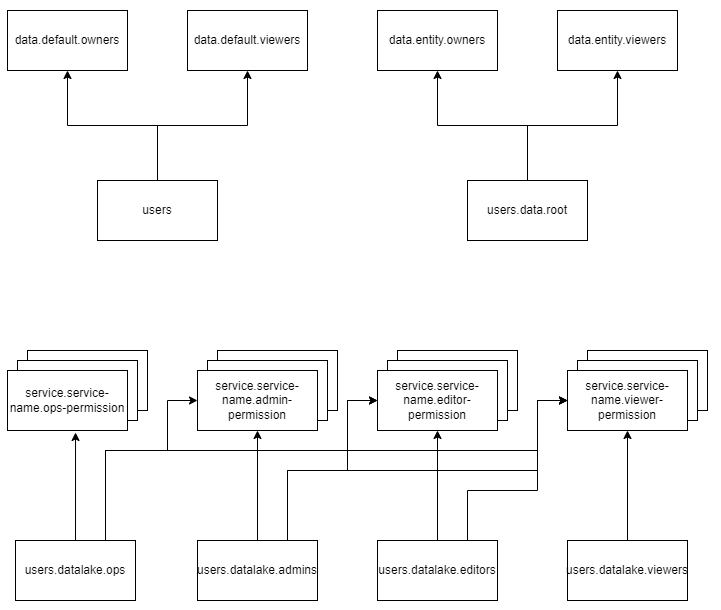

# Bootstrap groups structure

### Introduction
In order to bootstrap the minimum permission groups for a new partition to be functioning, the entitlements service implements the POST /tenant-provisioning API to bootstrap the basic service permission groups for a new partition.

The API is idempotent and needs to be executed for new provisioned partitions before the partition can be used.

The bootstrap groups and relationships created by this API are not allowed to be deleted.

### group structure

The following table illustrates all the groups created in the POST /tenant-provisioning API

| Group Category | Group Names | Description |
| -------------- | ----------- | ----------- |
| Root user group | users | A group contains all users of the partition, the identity needs to belong to this group to access the partition |
| Data admin group | users.data.root | A group will be automatically added to all data groups so that the member of it has the permission to all data on the partition |
| Basic Core permission groups | users.datalake.ops   users.datalake.admins   users.datalake.editors   users.datalake.viewers | The wrapped core permission groups, the identity needs to belong to one of them to access the partition |
| Default data group | data.default.owners   data.default.viewers | The default data groups for a partition and all users of the partition can access it |
| Service groups | service.storage.admin   service.storage.creator   service.storage.viewer   service.search.admin   service.search.user   service.entitlements.admin   service.entitlements.user   service.legal.admin   service.legal.editor   service.legal.user   service.plugin.user   service.messaging.user   service.schema-service.admin   service.schema-service.editors   service.schema-service.viewers   service.file.editors   service.file.viewers   service.workflow.admin   service.workflow.creator   service.workflow.viewer   service.document.viewer   service.index-document.user   service.content-extractor.user   service.gis-dl-transformation.user   service.gis-dl-ingestion.user   service.image-classification-classify.user   service.image-classification-train.user   service.form-extractor.user   service.mapping-service.editors   service.mapping-service.viewers | Service groups for different OSDU services |

The following table illustrates all and relationships created in the POST /tenant-provisioning API

| Child group | Parent groups |
| ----------- | ------------- |
| users | data.default.owners   data.default.viewers |
| users.datalake.viewers | service.storage.viewer   service.search.user   service.entitlements.user   service.legal.user   service.plugin.user   service.messaging.user   service.schema-service.viewers   service.file.viewers   service.workflow.viewer   service.document.viewer   service.mapping-service.viewers |
| users.datalake.editors | __All parents of users.datalake.viewers__   service.storage.creator   service.legal.editor   service.schema-service.editors   service.file.editors   service.workflow.creator   service.index-document.user   service.content-extractor.user   service.gis-dl-transformation.user   service.gis-dl-ingestion.user   service.image-classification-classify.user   service.image-classification-train.user   service.form-extractor.user   service.mapping-service.editors |
| users.datalake.admins | __All parents of users.datalake.editors__   service.search.admin   service.entitlements.admin   service.workflow.admin |
| users.datalake.ops | __All parents of users.datalake.admins__   service.storage.admin   service.legal.admin   service.schema-service.admins |