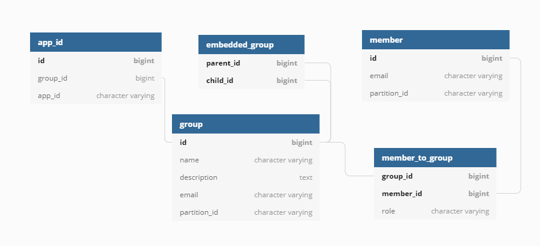

# JDBC Entitlements

## Database structure

## Entitlements tables

### Group

Group is a structure that provides specific access to its members.

#### id

This is the unique identifier of a group in the table.

**Value type:** `bigint`

**Properties:** NOT NULL, GENERATED, IDENTITY, **PRIMARY KEY**

#### name

The group name. Usually, it has the following format: `{groupType}.{resourceName}.{permission}` 

Where:
* `groupType` - type of the group (data, service, users, etc.);
* `resourceName` - name of a service group belongs to;
* `permission` - type of data access (viewers, owners).

**Value type:** `varchar`

**Properties:** UNIQUE

#### description

The group description in free format.

**Value type:** `text`

#### email

The group email. It is built by this format: `{name}@{data-partition-id}.{domain}.com`

**Value type:** `varchar`

**Properties:** UNIQUE

#### partition_id

The partition id of a group.

**Value type:** `varchar`
___
### Member

#### id

This is the unique identifier of a member in the table.

**Value type:** `bigint`

**Properties:** NOT NULL, GENERATED, IDENTITY, **PRIMARY KEY**

#### email

The member email. It is typically in this format: `member@domain.com`

**Value type:** `varchar`

**Properties:** UNIQUE

#### partition_id

The partition id of a member.

**Value type:** `varchar`
___

### Member to Group

Group and member connected by `Many-to-Many` relationship through this table. The table also 
contains the role of the member (`OWNER` or `MEMBER`).

#### group_id

This is the unique identifier of a group (the foreign key of `id` from the `group` table). 

**PRIMARY KEY** - (`group_id`, `member_id`)

**Value type:** `bigint`

**Properties:** NOT NULL, the part of **PRIMARY KEY**

#### member_id

This is the unique identifier of a member (the foreign key of `id` from the `member` table).

**Value type:** `bigint`

**Properties:** NOT NULL, the part of **PRIMARY KEY**

#### role

The role of a member (`OWNER` or `MEMBER`).

**Value type:** `varchar`

___

### Embedded group

Embedded group implemented by `Many-to-Many` relationship through this table.

#### parent_id

This is the unique identifier of a parent group (the foreign key of `id` from the `group` table).

**Value type:** `bigint`

**Properties:** NOT NULL, the part of **PRIMARY KEY**

#### child_id

This is the unique identifier of a child group (the foreign key of `id` from the `group` table).

**Value type:** `bigint`

**Properties:** NOT NULL, the part of **PRIMARY KEY**

### App Id

App id is one-to-many table for groups to support V2 functionality.

#### id

This is the unique identifier of app id relation in the table.

#### group_id

This is the unique identifier of a group (the foreign key of `id` from the `group` table).

**Value type:** `bigint`

**Properties:** NOT NULL

#### role

The app id of the particular group.

**Value type:** `varchar`